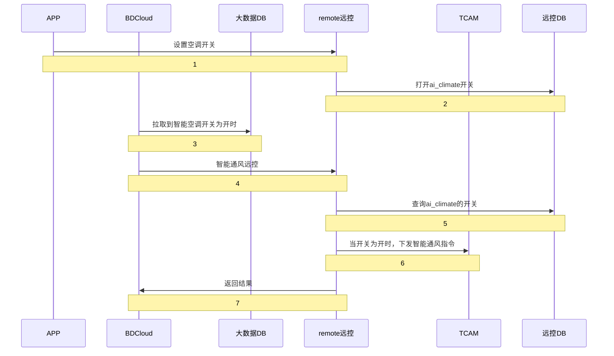

#### 5.1.19 AI 智能通风 (3.0)

##### 接口配置

| 配置 | 系统 |
|------|------|
| `#v2.2.0 add vehicle.cloud.ignore-service-ids=zav`<br>`rc.message.msgCodesMap[ZAY_START_CODE_APP]=;Operation_ZAY_3`<br>`rc.aiclimate-pool.queue-capacity=150` | Remote-control |

##### 接口功能说明

TSP 需提供执行开启智能空调功能的接口给 BDCloud。TSP 可以向 TCAM 发送执行智能空调的远控指令。TSP 需提供能力集配置，根据车型产品定义进行功能开启与关闭。

##### 5.1.19.1 接口使用说明

（内容未提供）

##### 5.1.19.2 接口设计说明


##### 5.1.19.3 接口协议与地址

```
POST /inner/v1.0/remoteControl/aiClimate
```

##### 5.1.19.4 接口参数

| 参数名 | 类型 | 必填 | 说明 |
|--------|------|------|------|
| durationDTOList | List | Y | 车架号和 duration 的集合 |
| serviceId | String | Y | 服务 ID (`zav`) |
| command | String | Y | 操作类型: `start` 开启 |

**VinDurationDTO**

| 参数名 | 类型 | 必填 | 说明 |
|--------|------|------|------|
| vin | String | Y | 车架号 |
| duration | Integer | N | 持续时长 [1-127] 单位分钟 |

##### 5.1.19.5 接口输入样例

AI 智能通风：

```json
{
  "serviceId": "ZAV",
  "command": "start",
  "durationDTOList": [
    {
      "vin": "e1124445",
      "duration": 127
    }
  ]
}
```

##### 5.1.19.6 接口返回

| 参数名 | 类型 | 必填 | 说明 |
|--------|------|------|------|
| sessionid | String | Y | 会话ID |

**示例：**

```json
{
  "respTime": 0,
  "code": "000000",
  "msg": "ok",
  "data": ""
}
```