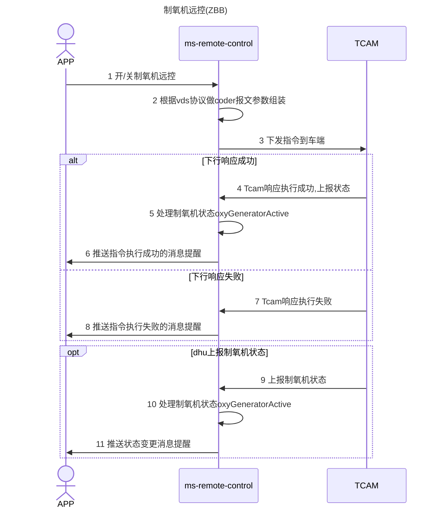

#### 5.1.28 制氧机远控 (ZBB)

##### 5.1.28.1 接口功能说明

制氧机远控

##### 5.1.28.2 接口使用说明

| 配置 | 系统 |
|------|------|
| `rc.message.msgCodesMap[ZBB_OPEN] = Operation_ZBB_1`<br>`rc.message.msgCodesMap[ZBB_CLOSE] = Operation_ZBB_2` | Remote-control |

##### 5.1.28.3 接口设计说明



##### 5.1.28.4 接口协议与地址

```
POST /v1.0/remoteControl/control
```

##### 5.1.28.5 接口参数

**主参数：**

| 参数名     | 类型   | 必填 | 说明               |
|------------|--------|------|--------------------|
| serviceId  | String | Y    | 服务ID (`ZBB`)     |
| command    | String | Y    | 操作类型: `start` / `stop` |
| setting    | T      | Y    | 其它参数           |

**`setting` 内部结构：**

| 参数名              | 类型                  | 必填 | 说明                     |
|---------------------|-----------------------|------|--------------------------|
| serviceParameters   | List<ServiceParameter>| Y    | 相关指令具体参数，每个 `ServiceParameter` 由 `key` 和 `value` 组成 |
| superiorOxyActivate | bool                  | Y    | （无说明）               |
| duration            | int                   | Y    | 范围 [1-127]，单位：分钟 |

##### 5.1.28.6 接口输入样例

**开启制氧机：**

```json
{
  "serviceId": "ZBB",
  "command": "start",
  "setting": {
    "serviceParameters": [
      {
        "key": "superiorOxyActivate",
        "value": "true"
      },
      {
        "key": "duration",
        "value": "3"
      }
    ]
  }
}
```

**关闭制氧机：**

```json
{
  "serviceId": "ZBB",
  "command": "stop"
}
```

##### 5.1.28.7 接口返回

| 参数名     | 类型   | 必填 | 说明     |
|------------|--------|------|----------|
| sessionid  | String | Y    | 会话ID   |

**返回示例：**

```json
{
  "respTime": 0,
  "code": "000000",
  "msg": "ok",
  "data": {
    "sessionId": "1658712640841"
  }
}
```

##### 5.1.28.8 上行

| 场景             | 参数路径                                              | 值 / 说明                      |
|------------------|-------------------------------------------------------|--------------------------------|
| 远控执行成功     | `RequestBody.serviceId`                               | `zbb`                          |
|                  | `RequestBody.serviceData.serviceResult.operationSucceeded` | `true`                         |
|                  | `RequestBody.serviceData.vehicleStatus.climateStatus` | `oxyGeneratorActive`（制氧机状态） |
| 远控执行失败     | `RequestBody.serviceId`                               | `zbb`                          |
|                  | `RequestBody.serviceData.serviceResult.operationSucceeded` | `false`                        |
|                  | `RequestBody.serviceData.serviceResult.error`         | `<the error code and message for this failure>` |
| IHU主动上报      | `RequestBody.serviceId`                               | `zbb`                          |
|                  | `RequestBody.serviceData.serviceCommand`              | `sys`（同步状态）              |
|                  | `RequestBody.serviceData.vehicleStatus.climateStatus` | `oxyGeneratorActive`（制氧机状态） |
